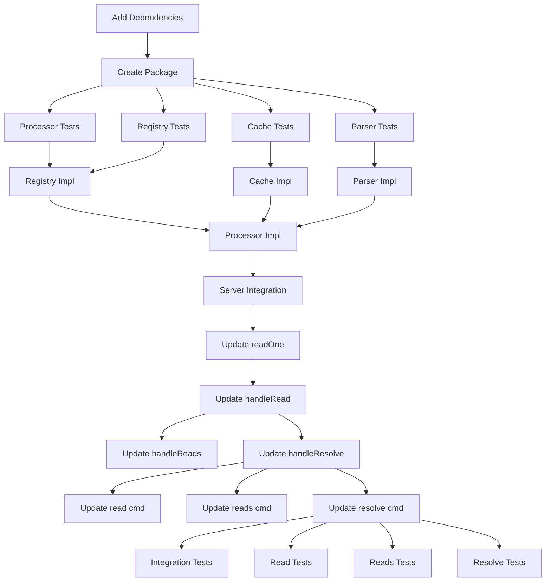

# Tasks: Output Template Functions

**Input**: Design documents from `/specs/001-output-template-functions/`
**Prerequisites**: plan.md, research.md, data-model.md, contracts/, quickstart.md

## Execution Flow (main)
```
1. Load plan.md from feature directory → ✅ COMPLETE
   → Tech stack: Go 1.24+, Masterminds/sprig v3, text/template
   → Architecture: internal/template/ package integration
2. Load design documents → ✅ COMPLETE
   → data-model.md: TemplateProcessor, TemplateContext, SafeFunctionRegistry
   → contracts/: Template API contracts
   → research.md: Security decisions, allowlisting strategy
3. Generate tasks by category → ✅ COMPLETE
4. Apply task rules → ✅ COMPLETE
5. Number tasks sequentially → ✅ COMPLETE
6. Generate dependency graph → ✅ COMPLETE
7. Create parallel execution examples → ✅ COMPLETE
8. Validate task completeness → ✅ COMPLETE
9. Return: SUCCESS (tasks ready for execution)
```

## Format: `[ID] [P?] Description`
- **[P]**: Can run in parallel (different files, no dependencies)
- File paths are relative to repository root

## Phase 3.1: Setup

- [x] **T001** Add Masterminds/sprig v3 dependency to go.mod
- [x] **T002** Create internal/template/ package structure with processor.go, safe_functions.go, parser.go, cache.go
- [x] **T003** [P] Configure template processor tests in internal/template/processor_test.go

## Phase 3.2: Tests First (TDD) ⚠️ MUST COMPLETE BEFORE 3.3

- [x] **T004** [P] Write TemplateProcessor interface tests in internal/template/processor_test.go
- [x] **T005** [P] Write SafeFunctionRegistry tests in internal/template/safe_functions_test.go
- [x] **T006** [P] Write reference parsing tests in internal/template/parser_test.go
- [x] **T007** [P] Write template cache tests in internal/template/cache_test.go
- [x] **T008** [P] Write template security tests (blocked functions) in internal/template/security_test.go
- [x] **T009** [P] Write template timeout tests in internal/template/timeout_test.go

## Phase 3.3: Core Implementation

- [ ] **T010** [P] Implement SafeFunctionRegistry in internal/template/safe_functions.go (allowlisted Sprig functions)
- [ ] **T011** [P] Implement TemplateCache in internal/template/cache.go (compilation caching with LRU)
- [ ] **T012** [P] Implement reference parser in internal/template/parser.go (query parameter extraction)
- [ ] **T013** Implement TemplateProcessor in internal/template/processor.go (main processing logic with timeout)

## Phase 3.4: Server Integration

- [ ] **T014** Add TemplateProcessor field to Server struct in internal/server/server.go
- [ ] **T015** Update readOneWithFlags function in internal/server/server.go to process templates after backend retrieval
- [ ] **T016** Update handleRead endpoint in internal/server/server.go to parse template references
- [ ] **T017** Update handleReads batch endpoint in internal/server/server.go for template support
- [ ] **T018** Update handleResolve endpoint in internal/server/server.go for env var template processing

## Phase 3.5: Command Integration

- [ ] **T019** Update read command in cmd/opx/main.go to handle template error responses
- [ ] **T020** Update reads command in cmd/opx/main.go to handle batch template errors
- [ ] **T021** Update resolve command in cmd/opx/main.go to handle template-processed env vars

## Phase 3.6: Integration Tests

- [ ] **T022** [P] Write end-to-end template test in internal/template/integration_test.go (fake backend)
- [ ] **T023** [P] Write read command template test in cmd/opx/read_template_test.go
- [ ] **T024** [P] Write batch reads template test in cmd/opx/reads_template_test.go
- [ ] **T025** [P] Write resolve command template test in cmd/opx/resolve_template_test.go

## Phase 3.7: Polish

- [ ] **T026** [P] Add comprehensive error handling tests in internal/template/error_test.go
- [ ] **T027** [P] Add performance benchmarks in internal/template/benchmark_test.go
- [ ] **T028** [P] Update documentation in README.md with template examples
- [ ] **T029** [P] Add template function reference documentation
- [ ] **T030** Run full test suite and verify all tests pass

## Dependencies



## Parallel Execution Examples

### Phase 3.2 (Tests) - Can run in parallel:
```bash
# All test files can be written simultaneously
Task agent: "Write TemplateProcessor interface tests in internal/template/processor_test.go" &
Task agent: "Write SafeFunctionRegistry tests in internal/template/safe_functions_test.go" &
Task agent: "Write reference parsing tests in internal/template/parser_test.go" &
Task agent: "Write template cache tests in internal/template/cache_test.go" &
wait
```

### Phase 3.3 (Core) - Most can run in parallel:
```bash
# Independent implementations
Task agent: "Implement SafeFunctionRegistry in internal/template/safe_functions.go" &
Task agent: "Implement TemplateCache in internal/template/cache.go" &
Task agent: "Implement reference parser in internal/template/parser.go" &
wait

# Depends on above
Task agent: "Implement TemplateProcessor in internal/template/processor.go"
```

### Phase 3.6 (Integration Tests) - Can run in parallel:
```bash
Task agent: "Write end-to-end template test in internal/template/integration_test.go" &
Task agent: "Write read command template test in cmd/opx/read_template_test.go" &
Task agent: "Write batch reads template test in cmd/opx/reads_template_test.go" &
Task agent: "Write resolve command template test in cmd/opx/resolve_template_test.go" &
wait
```

## Critical Path

The minimum viable implementation requires:
1. T001-T003 (Setup)
2. T004, T008, T009 (Critical tests)
3. T010-T013 (Core implementation)
4. T014-T016 (Basic server integration)
5. T019 (Basic command support)
6. T022 (Integration validation)

**Estimated effort**: 20-25 tasks, ~2-3 days with parallel execution